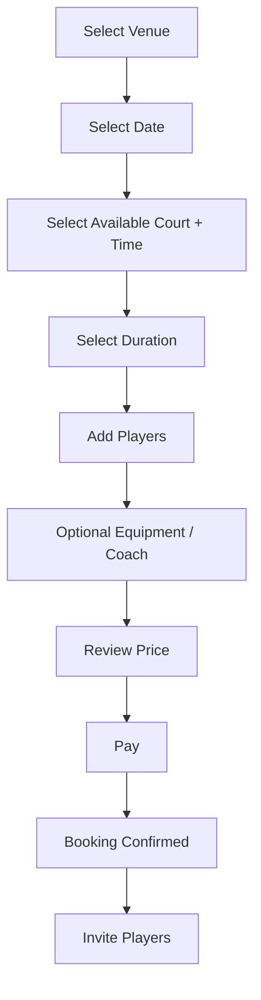
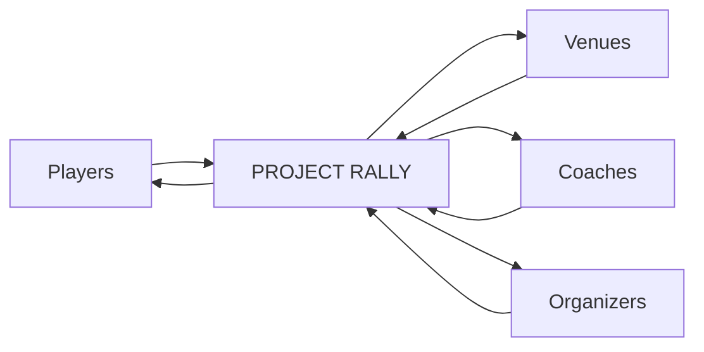
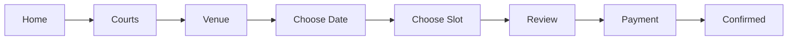
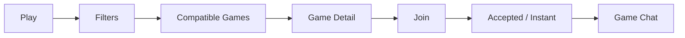
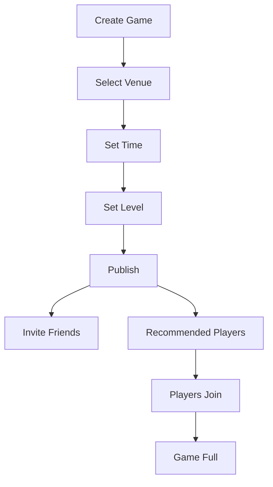
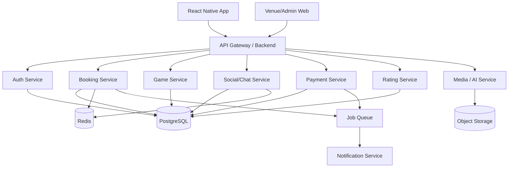

# PROJECT RALLY
## Pickleball Super App for Players, Courts, Clubs & Communities

> **Document type:** Product Concept + MVP PRD + Technical Blueprint  
> **Status:** Working concept  
> **Date:** August 11, 2026  
> **Initial market:** Philippines  
> **Expansion market:** Southeast Asia  
> **Working name:** Project Rally — placeholder only; final brand should be checked for trademark, App Store, Play Store, social handle, and domain availability.

---

## 1. Executive Summary

**Project Rally** is a mobile-first pickleball platform that connects the complete local pickleball experience in one application:

**Discover courts → book a court → find players → create/join games → pay → play → record scores → build a rating → join leagues/tournaments → improve with AI.**

The product is designed around two connected sides of the market:

1. **Players** who want an easier way to find courts, compatible players, games, coaching, events, and communities.
2. **Court operators / clubs** who need booking, payments, memberships, events, utilization, player communication, and customer acquisition.

The first version should **not** attempt to replace every existing global pickleball platform. The strongest initial opportunity is to build a localized, highly polished booking + matchmaking product for the Philippines, including local payments and a strong community layer, then expand across Southeast Asia.

### Product Thesis

Today, a pickleball player may need several separate systems:

- Facebook / Messenger / Viber / WhatsApp groups to find people.
- Google Maps or social media to find courts.
- A venue-specific website or chat conversation to reserve.
- GCash or bank transfer to pay.
- Spreadsheets or chat messages to manage leagues.
- DUPR or another platform for ratings.
- Separate apps or cameras for match analysis.

**Project Rally unifies the journey.**

### One-line Pitch

> **The easiest way to find a court, find your people, and play pickleball.**

### Longer Pitch

> Project Rally is a pickleball marketplace and community platform where players can discover courts, book available time slots, find compatible players, split payments, organize games, track results, join leagues and tournaments, and eventually use AI to understand and improve their game.

---

# 2. Why This Product, Why Now?

Pickleball is becoming more structured globally and in Asia. The opportunity is no longer only “teach people what pickleball is.” The next layer is infrastructure: **discovery, booking, matchmaking, competition, community, payments, and data.**

Current signals include:

- The **Philippine Pickleball Federation** operates the Philippine Pickleball Player Registry (PPPR), positioning it as a unified identity for players participating across clubs, tournaments, and communities.
- **PPA Tour Asia** announced plans to bring events to the Philippines at the Helios Pickleball complex in Pasig City from 2027; the announced project is a 25-court venue.
- PPA Tour Asia is already running professional events around the region.
- Established global apps validate demand for court discovery, game organization, club management, ratings, leagues, and match analytics.

This means there is a credible opening for a product built around the **local operating reality of Southeast Asian pickleball**, rather than treating the region as an afterthought.

### Strategic Position

Project Rally should start as:

> **A marketplace + social utility for recreational and competitive pickleball players.**

And grow into:

> **The operating network for pickleball in Southeast Asia.**

---

# 3. The Problem

## 3.1 Player Problems

Players commonly face fragmented workflows:

- “Where can I play near me?”
- “Which courts are available tonight?”
- “How much is the court?”
- “Do they have indoor courts?”
- “I need two more players.”
- “Are these players around my skill level?”
- “Who is collecting payment?”
- “Did everyone pay?”
- “Where do I see my match history?”
- “Are there tournaments this weekend?”
- “Who are the best coaches nearby?”
- “How do I improve?”

Much of this is currently solved manually through chat groups and individual venue systems.

## 3.2 Venue / Club Problems

Venue owners need to manage:

- Real-time court schedules.
- Walk-ins versus reservations.
- Peak and off-peak pricing.
- Cancellations.
- Deposits.
- Memberships.
- Player communication.
- Group bookings.
- Events.
- Coaches.
- Tournaments.
- Payment tracking.
- Court utilization.
- Repeat customers.
- Marketing.

Small and medium venues may not want a large enterprise system. They need something fast to onboard and easy for staff to operate.

## 3.3 Organizer Problems

Community organizers and tournament directors often need:

- Registrations.
- Divisions.
- Waitlists.
- Team creation.
- Brackets.
- Round robins.
- Score recording.
- Court assignment.
- Participant notifications.
- Payment status.
- Standings.

These frequently spill into spreadsheets, group chats, and multiple services.

---

# 4. Product Vision

## North Star

**Make playing pickleball take less coordination than ordering food.**

A player should be able to open Project Rally and, within a few taps:

1. See nearby courts and games.
2. Find an appropriate game.
3. Reserve or join.
4. Pay their share.
5. Get directions and reminders.
6. Play.
7. Record the result.
8. Find the next game.

---

# 5. Target Market

## Phase 1 — Philippines

Launch in one or two dense pickleball areas rather than nationwide on day one.

Suggested rollout style:

- Metro Manila
- Pampanga / Clark / Angeles
- Cebu
- Other cities based on venue density and partnership opportunities

The actual launch city should be selected after validating:

- Number of active courts.
- Number of organized player groups.
- Willingness of venues to use a booking platform.
- Frequency of open play.
- Existing booking friction.
- Local tournament activity.

## Phase 2 — Southeast Asia

Potential expansion:

- Singapore
- Malaysia
- Thailand
- Vietnam
- Indonesia

Each market may require different:

- Payment providers.
- Languages.
- venue practices.
- tax treatment.
- user verification.
- data/privacy compliance.

---

# 6. Target Users

## Persona A — Casual Player

**Example:** 28-year-old professional who plays after work.

Needs:

- Nearby courts.
- Easy booking.
- Friends to play with.
- Beginner-friendly sessions.
- Affordable game options.
- Simple payment.

Primary action:

> “Find me a game tonight.”

---

## Persona B — Regular / Competitive Player

Plays 3–5 times per week.

Needs:

- Skill-matched games.
- Match history.
- Rating.
- Competitive ladders.
- Tournament discovery.
- Player statistics.
- High-quality opponents.

Primary action:

> “Find me a competitive 3.5–4.0 doubles game.”

---

## Persona C — New Player

Needs:

- Learn the rules.
- Find beginner sessions.
- Rent equipment.
- Book coaching.
- Avoid joining games above their level.

Primary action:

> “I want to try pickleball for the first time.”

---

## Persona D — Court / Club Owner

Needs:

- Booking calendar.
- Payments.
- Pricing rules.
- Customer database.
- Occupancy analytics.
- Promotions.
- Memberships.
- Events.

Primary action:

> “Fill unused court hours while reducing admin work.”

---

## Persona E — Coach

Needs:

- Profile.
- Schedule.
- Lesson packages.
- Booking.
- Payments.
- Reviews.
- Students.
- Clinics.

Primary action:

> “Fill my coaching schedule.”

---

## Persona F — Tournament / League Organizer

Needs:

- Registration.
- Player ratings.
- Divisions.
- Brackets.
- Scores.
- Court assignment.
- Notifications.
- Standings.

Primary action:

> “Run an event without five spreadsheets.”

---

# 7. Core Product Pillars

Project Rally can be organized around six pillars.

## 7.1 PLAY

Find and join pickleball games.

## 7.2 BOOK

Discover and reserve pickleball courts.

## 7.3 CONNECT

Build a player network and local community.

## 7.4 COMPETE

Ratings, leagues, ladders, and tournaments.

## 7.5 IMPROVE

Coaches, clinics, player stats, and AI analysis.

## 7.6 OPERATE

Venue and organizer tools that power the supply side of the marketplace.

---

# 8. Player Mobile App

## 8.1 Onboarding

Initial onboarding should be extremely short.

### Step 1 — Account

Options:

- Apple Sign In
- Google Sign In
- Email
- Mobile number

### Step 2 — Location

Request location permission with clear value:

> See courts and games near you.

Manual city selection must remain available.

### Step 3 — Skill

Options:

- New / Never played
- Beginner
- Intermediate
- Advanced
- Competitive

If the player has a recognized rating, allow them to add it later.

### Step 4 — Preferences

- Singles
- Doubles
- Mixed doubles
- Recreational
- Competitive
- Indoor / outdoor preference
- Typical playing times

### Step 5 — Home

Immediately display actionable local inventory.

---

# 9. Home Screen

The home screen should answer:

> **What can I play next?**

Suggested layout:

```text
Good evening, Ralph 👋
Angeles City

[ Find a Game ]   [ Book a Court ]

PLAY NEAR YOU
--------------------------------
Today · 7:00 PM
Clark Paddle Club
Doubles · 3.0–3.5
2 / 4 players
₱250 per player
[ Join ]

Tonight · 9:00 PM
Pampanga Pickle Center
Open Play
12 going
₱180
[ Join ]

COURTS NEAR YOU
--------------------------------
Clark Paddle Club        1.3 km
4 courts                 From ₱500/hr
Available 7:00 PM

Pampanga Pickle Center   3.8 km
6 courts                 From ₱450/hr
Available 8:00 PM
```

Additional home modules:

- Upcoming booking.
- Friends playing nearby.
- Open spots.
- Nearby tournaments.
- Recommended clinics.
- “Play Again” from previous groups.

---

# 10. Court Discovery

## 10.1 Map + List

Filters:

- Distance.
- Available now.
- Date.
- Time.
- Indoor.
- Outdoor.
- Air-conditioned.
- Covered.
- Parking.
- Shower.
- Locker.
- Equipment rental.
- Coaching.
- Food/drinks.
- Price range.
- Court surface.
- Rating.
- Open play.
- Tournament venue.

## 10.2 Court Page

Each location contains:

- Venue name.
- Photos.
- Address.
- Map.
- Distance.
- Opening hours.
- Number of courts.
- Amenities.
- Court types.
- Pricing.
- Real-time availability.
- Venue policies.
- Cancellation rules.
- Reviews.
- Upcoming sessions.
- Upcoming events.
- Coaches.
- Rental equipment.
- Contact button.

### Primary CTA

**Book Court**

Secondary:

**Join Game at This Venue**

---

# 11. Court Booking

## Basic Flow



## Booking Options

- Private court.
- Public/open game.
- Open play.
- Coaching session.
- Clinic.
- Tournament/event.
- Recurring booking.

## Pricing Engine

Support:

- Per court.
- Per player.
- Hourly.
- Half-hour.
- Peak/off-peak.
- Weekday/weekend.
- Member/non-member.
- Promo code.
- Package credits.
- Deposit.
- Full payment.

---

# 12. Split Payments

This can become one of Project Rally’s strongest localized features.

Example:

Court costs **₱1,000**.

Four players:

```text
Court Total           ₱1,000

Ralph                  ₱250   PAID
Mark                   ₱250   PAID
Jenny                  ₱250   PENDING
Chris                  ₱250   PENDING
```

The organizer can:

- Pay everything.
- Split equally.
- Set custom amounts.
- Send payment reminders.
- Cover an unpaid share.

### Important Product Rule

A venue reservation should have **one authoritative booking/payment state**. Player-to-player split obligations are separate records to prevent booking status from becoming inconsistent.

---

# 13. Find Players / Matchmaking

This is a major differentiator.

## Quick Match

Player enters:

```text
WHEN?
Today 7 PM

WHERE?
Within 10 km

FORMAT?
Doubles

LEVEL?
3.0 – 3.5

[ FIND GAMES ]
```

Results rank games using:

- Skill compatibility.
- Distance.
- Time fit.
- Friends/mutual players.
- Reliability.
- Play style preferences.
- Venue preference.

---

# 14. Create a Game

Example:

```text
CREATE GAME

Venue
Clark Paddle Club

Date
August 15

Time
7:00 PM – 9:00 PM

Format
Doubles

Skill
3.0 – 3.5

Players Needed
3

Game Type
Casual

Cost
₱250 / player

Visibility
Public

[ CREATE GAME ]
```

Visibility:

- Public.
- Friends.
- Group only.
- Invite-only.

Join rules:

- Instant join.
- Request approval.
- Rating restricted.
- Gender/division restricted only where appropriate for organized competition.
- Invite code.

---

# 15. Match Compatibility

Do not overcomplicate the first version.

## MVP Score

```text
Compatibility =
  Skill Match        40%
  Time Match         20%
  Distance           20%
  Reliability        10%
  Social Connection  10%
```

Later:

- Preferred competitiveness.
- Communication style.
- Age bracket for social events, where appropriate.
- Frequency of play.
- Play style.
- Preferred side.
- Partner history.
- Competitive record.

### Reliability Score

Players can earn reliability from:

- Showing up.
- Paying on time.
- Responding to requests.
- Avoiding late cancellations.
- Completing matches.

Avoid creating a punitive public reputation system. Reliability can be displayed in simple levels:

- New.
- Reliable.
- Highly reliable.

---

# 16. Player Profile

Example:

```text
RALPH EVANO
@ralph

Angeles City

RALLY RATING
3.74

Reliability
Excellent

Games       128
Wins         74
Win Rate    57.8%

Preferred
Doubles

Clubs
Clark Paddle Club
Pampanga Pickle Community

ACHIEVEMENTS
🔥 8 Match Streak
🏆 Tournament Finalist
🎾 100 Games
```

Profile sections:

- Overview.
- Match history.
- Stats.
- Friends.
- Clubs/groups.
- Events.
- Achievements.
- Media/highlights.

Privacy controls are required.

---

# 17. Ratings

Project Rally should avoid pretending that a brand-new proprietary rating is automatically superior to established systems.

## Phase 1

Use a simple **Rally Skill Level**:

- Beginner.
- 2.0.
- 2.5.
- 3.0.
- 3.5.
- 4.0.
- 4.5.
- 5.0+.

Sources:

- Self-rating.
- Organizer verification.
- Match history.

## Phase 2

Develop a calculated **Rally Rating** using verified match results.

Consider optional integration with established rating ecosystems if commercial/API terms allow it.

DUPR currently uses a 2.000–8.000 rating range and provides a Reliability Score. Project Rally should complement recognized rating systems rather than falsely claiming equivalence.

---

# 18. Match Scoring

Players can log a match.

Example:

```text
MATCH RESULT

Ralph / Mark
11  8  11

Jenny / Chris
7   11  6

Winner:
Ralph / Mark

[ CONFIRM RESULT ]
```

Verification options:

- All players confirm.
- Organizer confirms.
- Tournament system auto-confirms.
- Venue scoring device confirms in future.

Disputed score workflow:

1. Result marked pending.
2. Players receive confirmation request.
3. Any dispute freezes rating impact.
4. Organizer/admin resolves if needed.

---

# 19. Friends & Social Graph

Social should support playing, not become another generic social network.

Features:

- Follow/add players.
- Favorite partners.
- Recently played.
- Invite to game.
- Create group.
- Group chat.
- Share game.
- Share tournament result.
- Post match photo/highlight.
- Player availability.

### “Play Again” Feature

After a positive game:

> Want to play with this group again?

One tap creates a draft session using the previous venue, players, and preferred time.

---

# 20. Groups / Communities

Examples:

- Pampanga Pickleball.
- Sunday Beginners.
- 3.5+ Clark Players.
- Company Pickleball Club.
- University Club.
- Women’s Open Play.
- Tournament Team.

Group tools:

- Membership.
- Announcements.
- Chat.
- Events.
- Games.
- Polls.
- Standings.
- Private court blocks.

---

# 21. Chat

Use real-time chat primarily for coordination.

Types:

- 1:1.
- Game chat.
- Group chat.
- Venue support.
- Tournament chat.

Features:

- Text.
- Images.
- Match/card sharing.
- Court sharing.
- Location sharing.
- Polls.
- System booking updates.

Avoid building advanced social messaging before the booking/matchmaking loop works.

---

# 22. Notifications

Useful notifications:

- Game request.
- Join approved.
- Someone joined your game.
- Court booking confirmed.
- Payment received.
- Payment reminder.
- Game tomorrow.
- Game starts in 2 hours.
- Court changed.
- Tournament bracket available.
- Match result awaiting confirmation.
- Friend invited you.
- Waitlist spot opened.
- Weather alert for outdoor booking, if supported.
- Venue cancellation.

Allow granular notification settings.

---

# 23. Tournament System

## Phase 1 Tournament Features

- Event discovery.
- Registration.
- Payment.
- Division selection.
- Player/partner registration.
- Event schedule.
- Notifications.
- Results.

## Phase 2 Organizer Engine

Formats:

- Single elimination.
- Double elimination.
- Round robin.
- Pool → knockout.
- Ladder.
- King/Queen of the Court.

Tournament dashboard:

```text
PAMPANGA OPEN 2027

Registrations       164
Paid                152
Waitlist             18

COURTS
1   In Progress
2   Available
3   In Progress
4   Delayed

CURRENT MATCH
Court 1
Santos / Cruz
vs
Reyes / Lim
```

---

# 24. Leagues & Ladders

Features:

- Season.
- Division.
- Schedule.
- Match windows.
- Standings.
- Points.
- Promotion/relegation.
- Player replacement.
- Team rosters.
- Playoffs.

Potential business model:

- Per league fee.
- Organizer subscription.
- Percentage of registration.

---

# 25. Coaching Marketplace

## Coach Profile

- Photo.
- Bio.
- Certifications.
- Experience.
- Skill specialties.
- Venue.
- Availability.
- Hourly rate.
- Packages.
- Reviews.
- Students.
- Clinics.

## Booking

```text
1-ON-1 LESSON
Coach Miguel

Tuesday
6:00 PM – 7:00 PM

Lesson               ₱1,200
Court                   ₱500
-----------------------------
Total                  ₱1,700

[ BOOK ]
```

Potential specialties:

- Beginner fundamentals.
- Serve.
- Return.
- Third-shot drop.
- Dinking.
- Doubles strategy.
- Tournament preparation.

---

# 26. AI Pickleball Coach — Long-Term Differentiator

AI should be a later layer, not the MVP dependency.

## Vision

Player places a phone near the court or uploads a match recording.

The system detects:

- Players.
- Court boundaries.
- Ball.
- Rally start/end.
- Serve.
- Score events where reliable.
- Player positions.
- Shot trajectories.
- Rally length.
- Winners.
- Errors.
- Kitchen positioning.
- Transition-zone behavior.

Then generates coaching insights.

Example:

```text
MATCH INSIGHTS

Rally Win Rate
58%

Average Rally
6.4 shots

Kitchen Possession
61%

Third Shot Drop Success
47%

Backhand Return Errors
8

AI COACH
You won 68% of points when both players
reached the kitchen before the opponent.

Your highest-loss pattern was remaining
in the transition zone after the third shot.
```

## AI Roadmap

### AI v1 — No Computer Vision

Use structured match data:

- Scores.
- Opponents.
- Ratings.
- Frequency.
- Court type.
- Match outcomes.

LLM can generate:

- Match recap.
- Progress summary.
- Training recommendations.
- Suggested practice plan.

### AI v2 — Assisted Video

Upload clips.

Allow users to manually mark:

- Serve.
- Rally.
- Point.
- Player.

Use vision to provide limited analysis.

### AI v3 — Full Match Analysis

Computer vision tracks:

- Court.
- Ball.
- Players.
- Shot patterns.
- Position.

### AI v4 — Live Court Intelligence

Venue-mounted cameras or dedicated devices enable:

- Automatic recording.
- Live score.
- Instant replays.
- Highlight generation.
- Tournament streaming.
- AI coaching.

Existing industry products are already validating AI-assisted pickleball analysis, which supports the concept but also means Project Rally needs a differentiated regional/product experience rather than “AI video” alone.

---

# 27. Highlights & Media

After match recording:

AI can create:

- Best rally.
- Longest rally.
- Match point.
- Best winner.
- Funny moment.
- 15-second reel.
- 30-second match recap.

Shareable card:

```text
Ralph / Mark
def.
Jenny / Chris

11–7 · 8–11 · 11–6

Rally Rating
3.74 ▲ 0.04

PROJECT RALLY
```

This becomes an organic acquisition loop.

---

# 28. Venue Partner Product

A web dashboard should accompany the consumer app.

## Main Modules

### Dashboard

- Revenue today.
- Bookings today.
- Court utilization.
- Upcoming bookings.
- Outstanding payments.
- New customers.
- Cancellation rate.

### Calendar

Visual court schedule:

```text
              6 PM     7 PM     8 PM     9 PM
Court 1       BOOKED   BOOKED   OPEN     OPEN
Court 2       OPEN     GAME     GAME     OPEN
Court 3       COACH    COACH    BOOKED   BOOKED
Court 4       OPEN     OPEN     OPEN     OPEN
```

### Bookings

- Create.
- Move.
- Cancel.
- Refund.
- Check in.
- No-show.

### Courts

- Court names.
- Surface.
- Indoor/outdoor.
- Availability.
- Maintenance block.
- Pricing rules.

### Customers

- Profiles.
- Booking history.
- Membership.
- Credits.
- Notes.

### Payments

- Payment status.
- Refunds.
- Venue payout.
- Transaction fees.
- Reports.

### Events

- Open play.
- Clinics.
- Leagues.
- Tournaments.

### Coaches

- Schedules.
- Commission.
- Lessons.

### Analytics

- Occupancy.
- Revenue.
- Average booking value.
- Peak hours.
- Repeat rate.
- New customers.
- Channel attribution.

---

# 29. Venue Onboarding

Keep onboarding simple enough that small clubs can start without technical staff.

## Venue Setup Wizard

1. Business details.
2. Address.
3. Operating hours.
4. Add courts.
5. Set prices.
6. Set booking rules.
7. Connect payout/payment method.
8. Upload images.
9. Publish.

Optional onboarding service:

> “Send us your current schedule/pricing and we’ll configure it for you.”

This can accelerate early venue acquisition.

---

# 30. Venue Booking Rules

System must support:

- Minimum duration.
- Maximum duration.
- Advance booking window.
- Same-day booking.
- Cancellation cutoff.
- Refund percentage.
- Member priority.
- Maintenance blocks.
- Private events.
- Holidays.
- Peak hours.
- Recurring reservations.
- Buffer time.
- Walk-in blocks.

These rules should be centralized in the booking engine.

---

# 31. Marketplace Model

Project Rally is a two-sided marketplace.



More players make the platform valuable to venues.

More venues make the platform valuable to players.

More games create match data.

More match data improves matchmaking.

Better matchmaking increases retention.

This creates a potential network effect.

---

# 32. Monetization

Use multiple revenue streams, but introduce them gradually.

## 32.1 Booking Fee / Commission

Example model:

- Venue booking: 3–8% platform commission.

Actual fee must be tested against venue margins.

Alternative:

- Small service fee paid by player.
- Lower/no venue commission.

---

## 32.2 Venue SaaS

### Starter

- Booking calendar.
- Court setup.
- Basic payments.
- Basic reports.

### Pro

- Memberships.
- Advanced rules.
- Events.
- CRM.
- Promotions.
- Analytics.
- Multiple staff accounts.

### Enterprise

- Multi-location.
- API.
- Advanced reporting.
- Custom branding.
- Dedicated support.

---

## 32.3 Player Premium

Potential **Rally+** subscription:

- Advanced stats.
- AI match recap.
- Unlimited video analysis quota.
- Rating insights.
- Priority waitlist.
- Premium filters.
- Discounted service fee.
- Cloud highlight storage.

Keep core finding and playing functionality free.

---

## 32.4 Tournament Fees

- Organizer software fee.
- Registration commission.
- Premium tournament tools.

---

## 32.5 Coaching Marketplace

- Commission per lesson.
- Coach Pro subscription.

---

## 32.6 Featured Placement

Venues can promote:

- Open play.
- Clinics.
- Tournaments.
- New locations.

Must be clearly labeled and never compromise ranking integrity.

---

## 32.7 Brand Partnerships — Later

Possible partners:

- Paddle brands.
- Shoes.
- Apparel.
- Hydration.
- Sports recovery.
- Pickleball travel.

Avoid cluttering the MVP with advertising.

---

# 33. MVP Definition

The MVP must prove this loop:

> **Open app → find something to play → reserve/join → pay → show up → play again.**

## Player MVP

- Authentication.
- Player profile.
- Location.
- Court map/list.
- Venue pages.
- Real-time court availability.
- Booking.
- Payment.
- Create game.
- Join game.
- Invite players.
- Basic skill level.
- Game chat.
- Notifications.
- Upcoming games/bookings.
- Match result.
- Basic history.

## Venue MVP

- Venue onboarding.
- Court management.
- Availability.
- Pricing.
- Booking calendar.
- Manual booking.
- Booking management.
- Payment status.
- Staff accounts.
- Basic analytics.

## Admin MVP

- User management.
- Venue approval.
- Booking lookup.
- Payment lookup.
- Refund support.
- Reports.
- Content moderation.
- Feature flags.

---

# 34. Features NOT Required for MVP

Do **not** delay launch for:

- Full AI video tracking.
- Proprietary advanced rating algorithm.
- Live streaming.
- Full tournament bracket engine.
- E-commerce.
- Paddle marketplace.
- Gamified NFTs/tokens.
- Advanced social feed.
- Wearable integration.
- Smart court hardware.
- International rollout.

They can become Phase 2/3 features after product-market validation.

---

# 35. Suggested App Navigation

Bottom tabs:

```text
HOME
PLAY
COURTS
COMMUNITY
PROFILE
```

Alternative:

```text
HOME
EXPLORE
CREATE +
ACTIVITY
PROFILE
```

Recommendation: start with the first model because it aligns directly with user intent.

---

# 36. Screen Inventory

## Authentication

- Splash.
- Welcome.
- Login.
- Registration.
- OTP.
- Profile setup.
- Skill setup.
- Location permission.

## Home

- Home.
- Search.
- Notifications.
- Upcoming activity.

## Courts

- Court map.
- Court list.
- Filters.
- Venue detail.
- Availability.
- Select slot.
- Booking review.
- Payment.
- Confirmation.
- Booking detail.

## Play

- Game discovery.
- Game filters.
- Game detail.
- Create game.
- Invite player.
- Join request.
- Game lobby.
- Game chat.
- Match scoring.
- Result confirmation.

## Community

- Friends.
- Players nearby.
- Groups.
- Group detail.
- Chat list.
- Chat.
- Activity.

## Competition

- Events.
- Event detail.
- Registration.
- Tournament schedule.
- Bracket.
- Standings.

## Coaching

- Coach discovery.
- Coach profile.
- Lesson selection.
- Booking.
- Lesson history.

## Profile

- Public profile.
- Edit profile.
- Rating.
- Match history.
- Stats.
- Achievements.
- Payments.
- Settings.
- Privacy.
- Help.

---

# 37. Critical User Flows

## Flow A — Book a Court



Success metric:

**Booking completed in less than 60 seconds for returning users.**

---

## Flow B — Find a Game



---

## Flow C — Create a Game and Fill It



---

# 38. Booking State Machine

A reliable booking state machine is essential.

```text
DRAFT
  ↓
PENDING_PAYMENT
  ↓
CONFIRMED
  ↓
CHECKED_IN
  ↓
COMPLETED
```

Alternative states:

- EXPIRED.
- CANCELLED.
- REFUND_PENDING.
- REFUNDED.
- NO_SHOW.

Never infer a payment result only from the mobile client. Payment confirmation should be driven by trusted server-side provider events/webhooks.

---

# 39. Payment Architecture

Potential payment options for a Philippines-focused product:

- GCash through an appropriate payment provider.
- Maya through an appropriate payment provider.
- Credit/debit card.
- Apple Pay / Google Pay where provider/market support makes sense.
- Venue credits.

Provider choice should be made during implementation based on current APIs, commercial terms, supported payment methods, payout model, and marketplace requirements.

## Payment Records

Maintain separate entities for:

- Order.
- Payment attempt.
- Provider transaction.
- Refund.
- Split obligation.
- Venue payout.
- Platform fee.

Use idempotency for booking/payment actions.

---

# 40. Cancellation Model

Example configurable venue policy:

```text
24+ hours before booking
100% refund

6–24 hours
50% refund

Under 6 hours
No refund
```

Project Rally should display the applicable cancellation policy before payment.

Games may have an additional social/reliability consequence for late withdrawal, but it should be fair and transparent.

---

# 41. Trust & Safety

Required features:

- Report player.
- Block user.
- Report venue.
- Cancel attendance.
- Moderation queue.
- Suspicious payment flags.
- Review moderation.
- Anti-spam rate limits.

For public games, avoid exposing exact personal information unnecessarily.

Use venue location as meeting location rather than player home address.

---

# 42. Reviews

Separate review concepts:

## Venue Review

- Court quality.
- Cleanliness.
- Staff.
- Amenities.
- Value.

## Coach Review

- Communication.
- Instruction.
- Professionalism.

Avoid public star-rating individual recreational players. Use lightweight private or aggregated reliability signals instead.

---

# 43. Recommended Tech Stack

The stack should optimize for rapid mobile development, strong TypeScript reuse, real-time features, payments, and future AI.

## Mobile

- **React Native**
- **Expo**
- **Expo Router**
- **TypeScript**
- Zustand for lightweight client state.
- TanStack Query for server state.
- React Hook Form + schema validation.
- NativeWind or a consistent design-system solution.
- Map SDK chosen based on regional coverage, cost, and required features.

## Venue / Admin Web

- **Next.js**
- **TypeScript**
- Tailwind CSS.
- Shared component library.

## Backend

Recommended:

- **Node.js + TypeScript**
- NestJS, Fastify, or a well-structured Express/Fastify service.
- REST for primary APIs.
- WebSockets for chat/live state where appropriate.
- Background jobs for notifications, expirations, and payment reconciliation.

## Database

- **PostgreSQL**

Good fit because booking requires:

- Transactions.
- Unique constraints.
- Range/time logic.
- Locking.
- Relational reporting.

## Cache / Realtime

- **Redis**
  - Cache.
  - Rate limiting.
  - Queues.
  - Pub/Sub.
  - Booking locks where required.

## Storage

- Object storage such as S3-compatible storage for:
  - Venue images.
  - Profile images.
  - Match videos.
  - Generated highlights.

## Search

Start with PostgreSQL + geospatial capability.

Later:

- Dedicated search engine if discovery complexity requires it.

---

# 44. High-Level Architecture



For the MVP, these can live inside one modular backend rather than separate microservices.

**Start as a modular monolith. Split services only when scale or organizational boundaries justify it.**

---

# 45. Suggested Monorepo

```text
project-rally/
│
├── apps/
│   ├── mobile/
│   ├── venue-web/
│   └── admin-web/
│
├── services/
│   └── api/
│
├── packages/
│   ├── ui/
│   ├── types/
│   ├── validation/
│   ├── api-client/
│   ├── config/
│   └── analytics/
│
├── infrastructure/
│
└── docs/
    ├── product.md
    ├── architecture.md
    ├── api.md
    └── database.md
```

---

# 46. Core Database Model

## Users

```text
users
- id
- email
- phone
- status
- created_at
- updated_at
```

## Player Profiles

```text
player_profiles
- user_id
- display_name
- username
- avatar_url
- city
- latitude
- longitude
- skill_level
- rally_rating
- reliability_level
- bio
- preferred_format
- privacy_settings
```

## Venues

```text
venues
- id
- owner_account_id
- name
- description
- address
- latitude
- longitude
- timezone
- status
- cancellation_policy_id
```

## Courts

```text
courts
- id
- venue_id
- name
- court_number
- surface
- indoor
- active
```

## Availability Rules

```text
availability_rules
- id
- court_id
- day_of_week
- start_time
- end_time
- slot_duration
```

## Pricing Rules

```text
pricing_rules
- id
- venue_id
- court_id
- days
- start_time
- end_time
- price
- pricing_type
- membership_type
```

## Bookings

```text
bookings
- id
- venue_id
- court_id
- creator_user_id
- starts_at
- ends_at
- status
- subtotal
- fees
- total
- currency
```

## Booking Participants

```text
booking_participants
- booking_id
- user_id
- role
- payment_share
- payment_status
```

## Games

```text
games
- id
- booking_id
- organizer_user_id
- format
- skill_min
- skill_max
- visibility
- join_policy
- capacity
- status
```

## Game Players

```text
game_players
- game_id
- user_id
- status
- joined_at
```

## Matches

```text
matches
- id
- game_id
- status
- started_at
- completed_at
- verified_at
```

## Match Teams

```text
match_teams
- id
- match_id
- team_number
```

## Match Players

```text
match_players
- match_team_id
- user_id
```

## Match Sets

```text
match_sets
- match_id
- set_number
- team_1_score
- team_2_score
```

## Ratings

```text
rating_events
- id
- user_id
- match_id
- rating_before
- rating_after
- change
- algorithm_version
```

## Payments

```text
payments
- id
- booking_id
- user_id
- provider
- provider_payment_id
- amount
- currency
- status
```

## Refunds

```text
refunds
- id
- payment_id
- amount
- reason
- provider_refund_id
- status
```

## Groups

```text
groups
- id
- name
- description
- owner_user_id
- visibility
- city
```

## Group Members

```text
group_members
- group_id
- user_id
- role
- status
```

## Chats

```text
conversations
conversation_members
messages
message_reads
```

## Notifications

```text
notifications
- id
- user_id
- type
- title
- body
- data
- read_at
- created_at
```

---

# 47. Preventing Double Booking

This is one of the most important backend requirements.

Do **not** rely only on:

> “Check availability, then insert booking.”

Two users can select the same slot simultaneously.

Use database-level enforcement and transactional booking.

Conceptually:

```text
BEGIN

lock / validate court time

ensure no overlapping confirmed reservation

create pending booking

create payment reservation

COMMIT
```

Depending on schema design, PostgreSQL range types/exclusion constraints can provide strong protection against overlapping reservations.

Redis may assist with short-lived reservation holds, but the database remains the final source of truth.

---

# 48. Temporary Slot Hold

During checkout:

```text
AVAILABLE
   ↓
HELD — 5 minutes
   ↓
PAID
   ↓
CONFIRMED
```

If payment is not completed:

```text
HELD
  ↓
EXPIRED
  ↓
AVAILABLE
```

This prevents multiple players from trying to pay for the same court.

---

# 49. API Surface — Initial

Example endpoints:

```text
POST   /auth/login
GET    /me
PATCH  /me/profile

GET    /venues
GET    /venues/:id
GET    /venues/:id/availability

POST   /bookings
GET    /bookings/:id
POST   /bookings/:id/checkout
POST   /bookings/:id/cancel

GET    /games
POST   /games
GET    /games/:id
POST   /games/:id/join
POST   /games/:id/leave

POST   /matches
POST   /matches/:id/result
POST   /matches/:id/confirm

GET    /players/:id
GET    /players/:id/matches

GET    /groups
POST   /groups
POST   /groups/:id/join

GET    /conversations
POST   /conversations/:id/messages
```

Use versioned APIs when public/external integrations begin.

---

# 50. Roles & Permissions

## Platform

- Player.
- Coach.
- Organizer.
- Venue staff.
- Venue manager.
- Venue owner.
- Platform support.
- Platform admin.

A user may have multiple roles.

Example:

A player can also be a coach and venue staff member.

Use account membership tables rather than a single `role` column on the user.

---

# 51. Analytics Events

Instrumentation should exist from the MVP.

Key events:

```text
app_opened
onboarding_started
onboarding_completed

venue_viewed
availability_viewed
booking_started
booking_payment_started
booking_completed
booking_cancelled

game_viewed
game_created
game_join_requested
game_joined
game_completed

invite_sent
invite_accepted

match_result_submitted
match_result_confirmed

group_joined
coach_viewed
lesson_booked
```

---

# 52. Product Metrics

## North Star Candidate

**Completed player sessions per week**

A “completed player session” means a player actually participated in a Project Rally game/booking.

This measures real-world value better than app opens.

## Marketplace Metrics

- Active venues.
- Available court hours.
- Booked court hours.
- Court utilization.
- Booking GMV.
- Take rate.
- Average booking value.
- Cancellation rate.

## Player Metrics

- Weekly active players.
- Games/player/month.
- Time to first game.
- Join conversion.
- Repeat game rate.
- 30-day retention.
- Match completion.
- Invite acceptance.

## Matchmaking Metrics

- Open game fill rate.
- Time to fill.
- Skill compatibility.
- No-show rate.
- Repeat-group rate.

---

# 53. Growth Loops

## Loop A — Invite Players

```text
User creates game
→ needs 3 players
→ invites friends
→ friends install/open app
→ join game
→ create profile
→ later create their own game
```

## Loop B — Venue Booking

```text
Venue joins
→ venue shares booking link
→ customers create accounts
→ users see other nearby games
→ more activity
→ more venues want access
```

## Loop C — Match Sharing

```text
Match ends
→ shareable result/highlight
→ social media post
→ viewer opens Rally link
→ installs app
```

---

# 54. Go-to-Market Strategy

Do not launch by saying:

> “We have a pickleball app.”

Launch by solving a specific community’s coordination problem.

## Step 1 — Recruit Anchor Venues

Target 3–10 partner venues in one launch area.

Offer:

- Free setup.
- Free initial SaaS period.
- Booking page.
- QR code.
- Customer import assistance.
- Staff training.
- Promotional placement.

## Step 2 — Recruit Community Organizers

Find people already running:

- Facebook groups.
- Messenger chats.
- Viber groups.
- Leagues.
- Open plays.

Give them:

- Free game management.
- Attendance.
- Waitlist.
- Payments.
- Notifications.

## Step 3 — Player Acquisition

At venue:

```text
SCAN TO BOOK
SCAN TO JOIN OPEN PLAY
SCAN TO SEE YOUR MATCH
```

Use QR codes heavily because acquisition occurs physically at courts.

## Step 4 — Events

Sponsor or power local:

- Beginner nights.
- Round robins.
- Ladders.
- Mini tournaments.

Every participant becomes a potential activated user.

---

# 55. Venue Sales Pitch

> Stop managing your pickleball bookings through messages and spreadsheets. Project Rally gives your players live court availability, online booking, payments, open-play registration, and game discovery while giving your staff one calendar for every court.

---

# 56. Player Marketing Pitch

> **Your next pickleball game is already here.**  
> Find courts, find players, book, split the cost, and play.

---

# 57. Brand Direction

Desired feeling:

- Premium but energetic.
- Social.
- Modern sports technology.
- Welcoming to beginners.
- Serious enough for competitive players.

Avoid making the product look too childish just because “pickleball” has a playful name.

## Possible Visual Direction

Base:

- Deep charcoal / black.
- Warm white.

Accent:

- Electric lime.
- Court green.
- Bright yellow.
- Orange-red.

Example:

```text
Background      #0B0D0C
Surface         #151815
Primary         #D9FF43
Text            #F5F6F2
Muted           #8A918B
Danger          #FF5C5C
```

---

# 58. Name Directions

These are **brainstorming directions only**, not availability claims:

- Rally
- RallyUp
- RallyPH
- Dink
- DinkUp
- PaddleMate
- PaddleUp
- CourtMate
- SideOut
- Kitchen
- KitchenUp
- PlayRally
- PaddleClub

Before using a final name, perform:

- Trademark check.
- Domain check.
- App Store search.
- Google Play search.
- Social handle search.
- Company name check.

---

# 59. Design Principles

## 1. Playing comes first.

The main CTA should always lead toward:

- finding a game,
- creating a game,
- or booking a court.

## 2. Local inventory matters more than content.

A perfect UI with no courts/games is useless.

## 3. Reduce coordination.

Every feature should replace a message like:

> “Guys sino available bukas 7 PM?”

## 4. Trust the backend, not the client.

Bookings, payments, ratings, and result verification require server-side authority.

## 5. Social features should support real play.

Avoid chasing generic feed engagement.

## 6. Beginner-friendly, competitive-ready.

The app must be unintimidating for new players but structurally strong enough for tournaments.

---

# 60. Suggested MVP Timeline

This is a planning framework, not a fixed estimate.

## Phase 0 — Validation

- Interview players.
- Interview venue owners.
- Map local court inventory.
- Observe current booking process.
- Test pricing.
- Secure pilot venues.

## Phase 1 — Foundation

- Monorepo.
- Auth.
- User profile.
- Database.
- Venue management.
- Maps.
- Admin.

## Phase 2 — Booking

- Availability engine.
- Court calendar.
- Booking.
- Checkout.
- Payments.
- Cancellation.
- Notifications.

## Phase 3 — Games

- Create game.
- Join game.
- Game lobby.
- Invites.
- Basic chat.
- Skill filters.

## Phase 4 — Match Layer

- Result entry.
- History.
- Player stats.
- Reliability.
- Basic ratings.

## Phase 5 — Pilot

Launch with a controlled group.

Measure:

- Booking completion.
- Failed bookings.
- Game fill.
- No-shows.
- Venue staff workload.
- Repeat play.

---

# 61. 12-Month Product Roadmap

## Quarter 1 — Marketplace Core

- Mobile app.
- Venue dashboard.
- Courts.
- Availability.
- Booking.
- Payments.
- Game creation.
- Player invitations.

**Goal:** Complete the play loop.

## Quarter 2 — Community

- Groups.
- Enhanced chat.
- Match history.
- Reliability.
- Reviews.
- Coaching discovery.
- Open play management.

**Goal:** Increase repeat play.

## Quarter 3 — Competition

- Ratings.
- Leagues.
- Ladders.
- Tournament registration.
- Basic bracket engine.
- Advanced venue reports.

**Goal:** Become infrastructure for organized play.

## Quarter 4 — Intelligence

- AI match recaps.
- Video upload.
- Highlight generation experiments.
- Advanced matchmaking.
- Dynamic recommendations.

**Goal:** Build differentiated player data/AI capabilities.

---

# 62. MVP Acceptance Criteria

The MVP is ready for a pilot when:

### Player

- Can register.
- Can find a venue.
- Can view correct availability.
- Can book an available court.
- Cannot double-book the same court.
- Can pay.
- Receives confirmation.
- Can cancel according to policy.
- Can create a public game.
- Another user can join it.
- Players can coordinate.
- Game can be marked completed.

### Venue

- Can manage courts.
- Can block time.
- Can change price.
- Can view booking.
- Can manually create booking.
- Can cancel/refund where allowed.
- Can see payment status.

### Platform

- Can investigate booking/payment issues.
- Has audit logs for critical operations.
- Can deactivate abusive accounts.
- Can approve/manage venues.

---

# 63. Non-Functional Requirements

## Performance

- Home/discovery should feel immediate.
- Availability requests should be cached appropriately without serving stale booking truth.
- Use pagination for feeds and player lists.

## Reliability

- Payment webhooks must be idempotent.
- Job retries.
- Booking reconciliation.
- Notification retries.
- Audit logging.

## Security

- Server-side authorization.
- Rate limiting.
- Input validation.
- Secure storage for secrets.
- No payment credentials stored directly unless fully compliant and intentionally designed.
- Verify provider webhooks.
- Protect admin routes with strong authentication.

## Privacy

- Minimal public personal data.
- Location privacy controls.
- Account deletion flow.
- Data export where required.
- Clear video consent for AI recording features.

## Observability

- Structured logs.
- Error tracking.
- Metrics.
- Payment alerts.
- Booking conflict alerts.
- Queue health monitoring.

---

# 64. AI/Data Consent

Video analysis introduces important consent requirements.

Before recording a match:

- All identifiable players should be informed.
- Venue recording rules should be visible.
- Users should be able to request removal where required.
- Private/public sharing must be separate choices.

Recommended model:

```text
Record match        YES
Analyze with AI     YES
Share with players  YES
Post publicly       NO
```

Do not bundle these permissions into one checkbox.

---

# 65. Future Integrations

Potential categories:

- Rating services.
- Pickleball federations.
- Venue management systems.
- Maps.
- Calendar.
- Payment providers.
- Smart locks/access control.
- Camera systems.
- Tournament platforms.
- Fitness/wearables.
- Social sharing.

Integrations should be selected based on actual partner/API access rather than assumed availability.

---

# 66. Competitive Landscape

Project Rally should learn from existing products rather than clone them.

## Pickleheads

Validated product areas:

- Court discovery.
- Open play.
- Games.
- Groups.
- Round robins.
- Leagues.
- Community.

Pickleheads currently advertises a directory of more than 25,000 places to play globally and has expanded its organizer/league tooling.

### Lesson

Court discovery alone is no longer enough. Community + structured play matter.

---

## DUPR

Validated product areas:

- Universal player rating.
- Match-based ratings.
- Reliability.
- Player profiles.
- Competitive ecosystem.

In 2026 DUPR added deeper rating/profile insights including Subscores, Career High, and DUPR Impact.

### Lesson

Ratings become a network product. Project Rally should initially integrate/complement rather than make “better rating” its launch claim.

---

## CourtReserve

Validated product areas:

- Court reservations.
- Club operations.
- Memberships.
- Payments.
- Events.
- Coaching.
- Public booking.

CourtReserve also supports advanced scheduling logic such as waitlists, booking restrictions, prime-time access controls, recurring reservations, and multi-court management.

### Lesson

Venue software gets operationally deep very quickly. Project Rally should keep the MVP simple, then expand based on local venue needs.

---

## AI Match Technology

Existing pickleball products and partnerships are validating:

- AI-assisted match recording.
- Replays.
- Coaching.
- Ratings/video analysis.

### Lesson

AI can become a differentiator, but **distribution, court inventory, and active player networks are the moat needed first.**

---

# 67. Competitive Positioning

Project Rally should occupy:

```text
              COMMUNITY
                  ▲
                  │
      Pickleheads │       PROJECT RALLY
                  │          ★
                  │
LOW BOOKING ──────┼──────────────► DEEP BOOKING
                  │
                  │       CourtReserve
                  │
                  ▼
             OPERATIONS
```

A separate axis is competitive identity/ratings, where DUPR is highly specialized.

Project Rally’s intended advantage:

> **Localized court marketplace + booking + player matching + community + payments, with competitive and AI layers added over time.**

---

# 68. Philippines-First Differentiators

Potential differentiators:

- Local court inventory.
- GCash/Maya-friendly payment experience through supported providers.
- Peso pricing.
- Split payment.
- Messenger-friendly sharing.
- Local city/community discovery.
- Venue onboarding for operators still using manual chat.
- Local tournaments.
- Federation/club partnership opportunities.
- English-first UI with room for localized content.
- Southeast Asia expansion architecture from the beginning.

---

# 69. Biggest Product Risk

The biggest risk is **not engineering**.

It is marketplace liquidity.

A user opens the app and sees:

```text
0 nearby games
0 bookable courts
```

They may never return.

Therefore launch must be city-by-city with actual supply.

### Correct Sequence

```text
VENUES
  ↓
ORGANIZERS
  ↓
SCHEDULED GAMES
  ↓
PLAYERS
  ↓
NETWORK EFFECT
```

Not:

```text
BUILD EVERYTHING
  ↓
PUBLISH APP
  ↓
HOPE PEOPLE COME
```

---

# 70. Validation Before Full Build

Interview at least:

- 20 active players.
- 5 beginners.
- 5 organizers.
- 5–10 venue owners/managers.
- 3 coaches.

Questions for players:

- How do you currently find games?
- How do you book?
- What is frustrating?
- How often do you play?
- How much do you pay?
- Who usually organizes?
- What causes games to be cancelled?
- Would you play with people you do not know?
- How important is skill matching?
- What would make you use one app every week?

Questions for venues:

- How do bookings arrive?
- How much staff time goes into coordination?
- What causes errors?
- How do you collect deposits?
- How many no-shows?
- How do you fill off-peak courts?
- What software do you use?
- Would you allow external marketplace bookings?
- What fee model would you accept?

---

# 71. Initial Business Experiment

Before building the full product, test with a lightweight pilot.

Example:

1. Partner with one venue.
2. Add 4–8 courts into a minimal system.
3. Onboard 100 local players.
4. Publish scheduled open games.
5. Allow users to join and pay.
6. Track whether games fill faster.
7. Track repeat players.

### Success Signal

A strong signal would be:

> A meaningful percentage of players use Project Rally again within the next few weeks without needing manual prompting from the team.

---

# 72. Launch Version Concept

## Home

> **PLAY TODAY**

Show immediately:

- Games starting soon.
- Available court slots.
- Friends playing.
- Open spots.

## Primary CTAs

**Find Game**

**Book Court**

Everything else is secondary.

---

# 73. Example End-to-End Story

Ralph opens Project Rally after work.

The app knows his preferred city and approximate skill.

He sees:

```text
7:30 PM · Clark Paddle Club
3.0–3.5 Doubles
3 / 4 players
₱250
```

He taps **Join**.

The app shows:

- Three players.
- Venue.
- skill range.
- cancellation policy.
- payment.

He pays ₱250.

The group receives:

> Ralph joined. Game full.

At 6:30 PM:

> Your game starts in 1 hour.

He arrives and checks in.

After playing, the organizer enters:

```text
11–7
8–11
11–6
```

Players confirm.

Ralph’s match history updates.

The next day:

> Mark is creating another game Friday at 8 PM. Join?

That is the retention loop.

---

# 74. Future Vision

Once Project Rally has sufficient court and player density, it can become much larger than booking.

Potential future experience:

> “Rally, find me a 3.5 doubles game tomorrow after 7 PM, within 20 minutes of Clark, indoor only, under ₱400.”

The system returns three options.

The player chooses one.

Project Rally:

- Books the spot.
- Processes payment.
- Adds the calendar event.
- Opens the game group.
- Gives directions.
- Tracks the result.
- Updates performance.
- Recommends the next game.

At this stage Project Rally becomes a **sports activity agent**, not merely a booking app.

---

# 75. Recommended Build Priority

If engineering started tomorrow:

## P0

1. Auth.
2. User/player profile.
3. Venue model.
4. Court model.
5. Availability engine.
6. Booking state machine.
7. Payment.
8. Venue calendar.
9. Game creation.
10. Game joining.
11. Notifications.

## P1

12. Invites.
13. Chat.
14. Match scores.
15. Match history.
16. Reliability.
17. Groups.
18. Basic analytics.

## P2

19. Ratings.
20. Leagues.
21. Tournaments.
22. Coaches.
23. Memberships.

## P3

24. Video.
25. AI coaching.
26. Automatic highlights.
27. Smart court integrations.

---

# 76. Definition of Product-Market Fit Direction

The strongest early indicator is not download count.

Look for behavior such as:

- Players book multiple times per month.
- Games reliably fill through the platform.
- Organizers stop using spreadsheets for attendance.
- Venue staff ask to route more bookings through Project Rally.
- Players invite others organically.
- A city becomes dense enough that users routinely have multiple playable options.

---

# 77. Suggested Founder Dashboard

```text
PROJECT RALLY
Marketplace Health

Active Players              2,840
Weekly Playing Players      1,204
Partner Venues                 18
Bookable Courts                74

Bookings This Week             612
Completed Player Sessions    2,104

Game Fill Rate                 78%
Median Time to Fill          2.4 hr

Booking GMV                ₱842,500
Platform Revenue            ₱51,230

30-Day Player Retention        42%
```

This dashboard should focus the company on real play and marketplace density.

---

# 78. Key Strategic Recommendation

**Do not begin with AI.**

AI is visually exciting, but the most valuable first problem is:

> **I want to play pickleball. Make that easy.**

Win:

- Court inventory.
- Booking.
- Local payments.
- Player matching.
- Community density.

Then attach:

- ratings,
- competition,
- coaching,
- AI.

If the marketplace becomes the place where players already organize their real-world games, the later data and AI features become substantially more valuable.

---

# 79. Product Summary

## Project Rally is:

**For players**

- Find courts.
- Book.
- Find games.
- Find people.
- Pay.
- Compete.
- Improve.

**For venues**

- Manage courts.
- Accept bookings.
- Collect payments.
- Fill capacity.
- Run events.
- Grow customers.

**For organizers**

- Manage groups.
- Fill games.
- Run leagues.
- Run tournaments.

**For coaches**

- Get discovered.
- Book lessons.
- Manage schedules.
- Grow students.

## Ultimate Goal

> **Build the digital infrastructure connecting pickleball players, venues, coaches, organizers, and competitions across Southeast Asia.**

---

# 80. Recommended Next Documents

This concept can be broken into implementation-ready documents:

1. `01-product-prd.md`
2. `02-mobile-screen-spec.md`
3. `03-user-flows.md`
4. `04-database-schema.md`
5. `05-api-specification.md`
6. `06-booking-engine.md`
7. `07-payment-architecture.md`
8. `08-venue-dashboard.md`
9. `09-design-system.md`
10. `10-mvp-roadmap.md`
11. `11-ai-video-roadmap.md`
12. `12-launch-and-growth.md`

This master document should remain the product north star while those files become more detailed technical specifications.

---

# 81. Current Market References

Market notes in this document were checked on **August 11, 2026**. Product features and commercial terms can change and should be reverified before implementation or partnership decisions.

- Philippine Pickleball Federation — Philippine Pickleball Player Registry  
  https://www.pickleball.ph/

- PPA Tour Asia — Philippines / Helios Pickleball announcement  
  https://www.ppatour-asia.com/ppa-tour-asia-to-bring-tournaments-to-philippines-helios-pickleball-complex/

- Pickleheads — Court, game, group and organizer platform  
  https://www.pickleheads.com/

- DUPR — Rating system and product information  
  https://www.dupr.com/how-it-works  
  https://www.dupr.com/post/new-dupr-features-to-help-you-understand-your-game

- CourtReserve — Pickleball club management / court scheduling  
  https://courtreserve.com/pickleball/  
  https://courtreserve.com/pickleball-court-scheduling-software-features/

---

# 82. Closing Vision

The winning version of this product is not:

> “An app about pickleball.”

It is:

> **The app people open when they want to play pickleball.**

That difference should guide every product decision.
